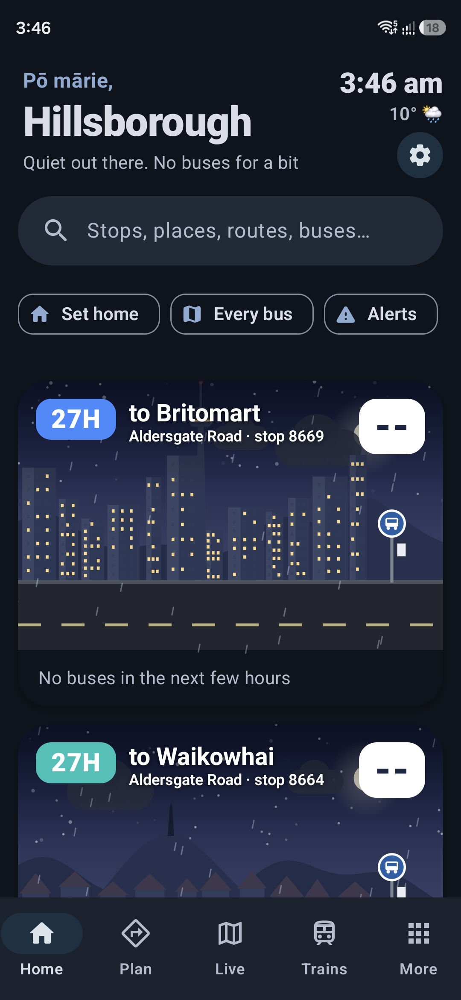
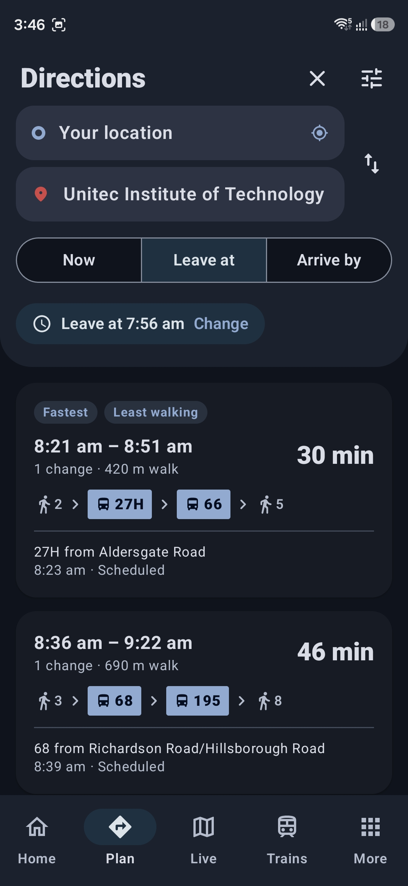
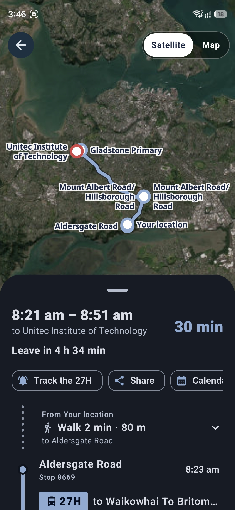
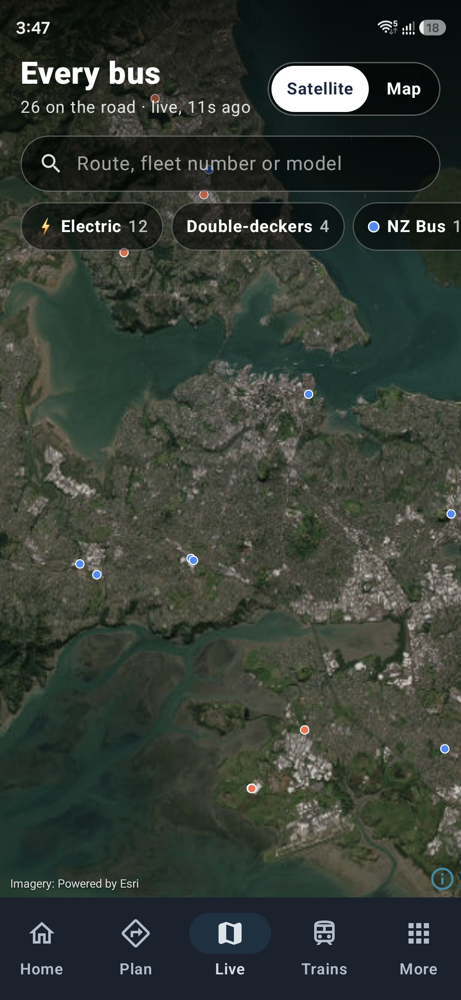
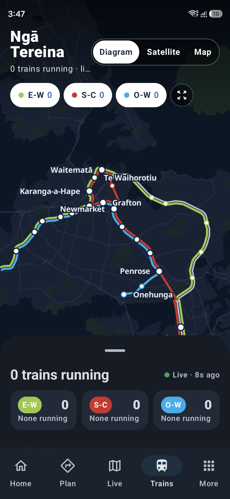
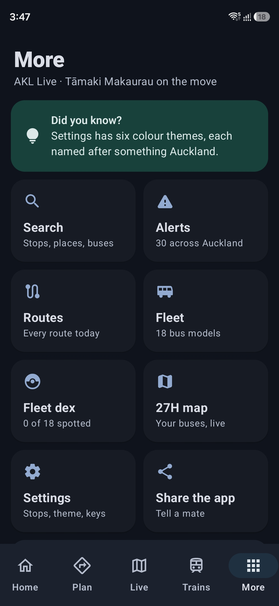

# AKL Live

A native Android app for getting around Auckland: live buses, trains and
ferries, journey planning on AT's full timetable, and a few quirks. Built for
the Galaxy S26 with Kotlin, Jetpack Compose and Material 3. It started as the
phone version of
[akl-departure-board](https://github.com/intelarc/akl-departure-board), the
ESP32 desk display, and brings over the features of the desktop app.

  
  
  

  
  
  

Home · Directions · A journey · Every bus · Trains · More

## Install

Open **Releases → latest** on the phone, download `AKL-Live.apk` and open it.
Android asks once to allow installs from your browser. Every push to `main`
builds a new signed APK there. Installing it updates the app in place.

The app needs an Auckland Transport API key, and none is built in. Sign up at
[dev-portal.at.govt.nz](https://dev-portal.at.govt.nz) (it's free), subscribe
to the GTFS and realtime APIs, and paste your key in the app's Settings. Home
shows a card pointing there until a key is set.

The bottom bar has **Home**, **Directions**, **Live** (every bus), **Trains**
and **More** (search, alerts, routes, the fleet, the fleet dex, settings).

## Home

A greeting for the time of day (Mōrena, Kia ora, Ahiahi mārie in Kiwi mode), a
line on how things look ("The 27H's running 6 min late, eh", "Double-decker
incoming"), the time and the weather, then:

- **Leave in…** for the next bus each way, from how long your walk to the stop
  is. Miss it and it tells you when to leave for the one after, or to run.
- **A search bar** for everything, and one-tap chips: take me home, to work,
  every bus, alerts.
- **Your stops' live scenes** (below), each with **Track** and **All departures**.
- **The next 12 hours of weather**, with the chance of rain.
- **Favourite stops** with their next departures, live.
- **Stops near me** from your location.
- **The live route map** and your **fleet dex** progress.

Home's scenes follow your stops: by default the 27H at Aldersgate Road,
Hillsborough, both directions (stop 8669 to Britomart, 8664 to Waikowhai).

- **A live scene per direction.** The bus drives toward the stop as its arrival
  counts down, and its wheels turn while it's moving. The sky follows the real
  time of day: sunrise, the sun's arc, sunset, then stars and a crescent moon,
  with lit windows and the Sky Tower's beacon. The weather is Auckland's real
  weather ([Open-Meteo](https://open-meteo.com)): cloud cover greys the sky, and
  it drizzles, rains, fogs over or flashes with thunder when Auckland does. The
  city lane has the skyline with Rangitoto behind; the Waikowhai lane has houses,
  pōhutukawa in flower and Maungakiekie's obelisk.
- **The next bus in detail.** It shows the expected arrival against the
  timetable, on time or minutes late, and a track of the stops between the bus
  and you with the last one it passed. From its GPS it also shows how far away
  it is in km, its speed and how full it is.
- **What bus is coming.** The fleet number in AT's feed (`TR3884`, `NB5760`)
  gives the operator and, where the fleet list knows it, the model: a CRRC
  eT12 MAX, an eD12 MAX double-decker, an Enviro200... Electric buses get a ⚡,
  and the scene draws the right bus (double-deckers, no exhaust on electrics).
- **The next five buses** with live and scheduled times and models.
- **A live satellite map of the whole 27H.** Both directions over real aerial
  photos (or a street map), every bus on its way to you gliding between GPS
  fixes and pointing where it's heading. Tap it for full screen, then tap a bus
  to see what it is. Pull down anywhere to refresh.
- **Tap the scene** and the bus honks.

## Directions

Journey planning across buses, trains and ferries, on the phone. AT's full
GTFS timetable (about 29 MB) downloads once, is checked for updates every six
hours, and each service day is compiled into a compact network cached on the
phone. A RAPTOR planner, ported from the desktop app, finds the fastest
journeys with 1, 2, 3 or more rides, walking between nearby stops for changes.

- **From and to**: your location, home, work, favourite stops, recent places,
  any stop or station, any address or place (Photon / OpenStreetMap), or a pin
  dropped on the map.
- **Leave now, leave at or arrive by**, today or any day in the next week.
- **Options**: how far you'll walk, your pace, buses/trains/ferries, how many
  changes.
- **Each option** shows its times, the rides in order, walking, changes and
  "leave in", with live delays on the first ride and tags for the fastest,
  fewest changes and least walking. If walking there takes under 25 minutes,
  that shows too.
- **The journey view**: the whole trip over a map, with the ride shapes and
  every bus or train live on them, walking paths with turn-by-turn directions
  (OSRM), every stop on each ride, platforms, and "3 stops away" / "you're on
  it: 5 stops to go". Share it, add it to your calendar, or track a ride.

## Stops, routes and search

- **Any stop or station**: live departures from every platform, filtered by
  route, with each bus's model, how late it is and how many stops away. Tap one
  to see the bus and track it. There's a map of the stop with the buses heading
  for it (tap one to see its route), alerts for the stop and its routes,
  favourites with nicknames, directions to or from it, and **add to home
  screen** as its own icon.
- **Any route**: its paths on a map, its stops each way, trips today, first and
  last departures, who runs it, and every bus on it right now.
- **Search** finds stops (by name or the number on the sign), routes, places,
  bus models and fleet numbers. With nothing typed, it shows saved places,
  favourites and recent searches.
- **Alerts**: AT's disruptions with yours first (your route, stops and
  favourites), then everything happening now or coming up, searchable by route.

## On your phone

- **Track a bus**: a notification that counts down to it on its own, shows how
  many stops away it is, its model and how full it is, updated every 20 s. It
  buzzes when it's time to leave (your walk plus a lead time you choose), and
  stops itself once the bus has been.
- **Home screen widget**: your next bus each way, refreshed in the background.
- **Quick settings tile**: "27H · 6 min" in the notification shade.
- **App shortcuts**: long-press the icon for Directions, Live, Trains, Search
  and your favourite stops.
- **Links**: `akllive://stop/8669`, `akllive://route/27H`, `akllive://plan` and
  the rest open straight to the screen.

## Looks and quirks

- **Material 3** throughout, with six colour themes named after Auckland
  things (Waitematā, Pōhutukawa, Kawakawa, Kōwhai, Rangitoto, Tūī), Material
  You colours from your wallpaper, light, dark and pure black.
- **Shake to refresh**, haptics on taps, predictive back, a splash screen,
  and a themed icon.
- **Kiwi mode**: "Sweet as", "Chur!", "Gutted.", "Time to hit the road!".
- **Fleet dex**: every bus model that pulls up at your stops is spotted and
  counted, from Rookie spotter to Ultimate spotter. Unseen ones stay mysteries.
- A few things to find in search, and in Settings' version number.

## Live

Every bus in Auckland on one map, about a thousand at a time, coloured by
operator and gliding between GPS fixes. Zoom in and each one shows its heading
and route number.

- **Search** by route (`27` finds the 27H, 27W and 27T), fleet number
  (`NB5075`) or model (`eT12`), and the map frames what it found.
- **Filters** for electric buses, double-deckers or one operator, with live counts.
- **Tap a bus** for its route and destination, how late it's running, its
  speed, how full it is and what model it is. Tap the model for its page.

## Fleet

Every bus model on the network (the CRRC eT12 MAX, Geely C13E, Enviro500 and
the rest), sorted by how many are out right now.

- **Each model has its own page:** a drawing of it (double-deckers, tri-axles,
  electrics), specs such as length, seats, motor and top speed, a short
  history, the fleet numbers each operator uses, and a live map of every one of
  them on the road, with a list you can tap to find each bus.
- Buses whose fleet numbers aren't in the list yet are grouped under **Not
  identified yet**, with their own map.

## Trains

Auckland's rail network on a real map, drawn the way the desktop app draws it,
with every train live on it.

- **The real tracks.** Each line follows the rails its trains run on today, cut
  from the shapes in AT's timetable. Where lines share rails they run side by
  side in AT's colours (E-W, S-C, O-W), easing on and off the shared track so
  they meet and part without crossing. Stations whose platforms are on different
  tracks get a bar joining them, as on AT's map. Straight lines stand in until
  the timetable has loaded.
- **Te Huia** runs from The Strand out along the eastern line and on to
  Hamilton.
- **Every train, live**, snapped onto its own line and pointing the way it's
  going, with an orange or red dot when it's running 2 or 5+ minutes late.
- **Diagram, Satellite or Map.** Diagram is a quiet map (land, water, parks and
  suburb names) that lets the lines stand out. Station names appear as you zoom
  in, the most important first.
- **Tap a train** for its destination, speed, delay, how full it is, and its
  next stops with expected times. **Tap a station** for live departures from
  every platform.
- **Line filters** (E-W, S-C, O-W) with live counts, and a network overview
  showing how many trains on each line are running late. Landscape puts the map
  beside the panel.

## How it's built

Kotlin, Jetpack Compose and Material 3, with navigation-compose, Glance for
the widget and WorkManager behind it. The scenes, the train diagram and the
vehicle markers are drawn with Compose Canvas. The journey planner
(`gtfs/`) is plain Kotlin: a streaming GTFS reader, a compiler that turns a
service day into flat arrays (routes, stops, trips grouped into patterns,
footpaths between stops within 450 m, shapes) saved to disk, and RAPTOR over
them. The real maps are
[MapLibre](https://maplibre.org) (open source), with:

- satellite: [Esri World Imagery](https://www.arcgis.com/home/item.html?id=10df2279f9684e4a9f6a7f08febac2a9),
  or with a free [LINZ Basemaps](https://basemaps.linz.govt.nz) key, Toitū Te
  Whenua LINZ's aerial photos (7.5 cm in Auckland, CC BY 4.0). Paste a key in
  Settings.
- streets: [OpenFreeMap](https://openfreemap.org) (OpenStreetMap data).

Transit data comes straight from the
[AT developer API](https://dev-portal.at.govt.nz):

| What | Endpoint |
|---|---|
| Stop timetable | `gtfs/v3/stops/{id}/stoptrips` |
| Live delays, stops away | `realtime/legacy/tripupdates?tripid=` |
| Bus and train GPS | `realtime/legacy/vehiclelocations?tripid=` / `?vehicleid=` (all trains are 59xxx) |
| Train destination and stops | `gtfs/v3/trips/{id}` and `.../stoptimes` |
| Station departures | stoptrips for each platform (platforms from `parent_station`) |
| Every bus (Live, Fleet) | `realtime/legacy/vehiclelocations`, the whole feed (~80 KB gzipped) |
| Bus operator and model | the vehicle label (`TR3884`) looked up in `app/src/main/assets/fleet.tsv` and `models.json` |
| Service alerts | `realtime/legacy/servicealerts` |
| The timetable (Directions, stops, routes) | `https://gtfs.at.govt.nz/gtfs.zip` |

Other open services: [Photon](https://photon.komoot.io) for places,
[FOSSGIS OSRM](https://routing.openstreetmap.de) for walking directions and
[Open-Meteo](https://open-meteo.com) for weather. None needs a key.

Train GPS fixes are snapped onto the nearest station-to-station stretch of the
train's own line on the schematic. `tools/gen_data.py` generates the map
geometry, the station/platform table and the 27H's stop lists into
`app/src/main/java/nz/aryan/akllive/data/`:

    AT_API_KEY=... python tools/gen_data.py

The app polls only while it's on screen: buses every 30 s, trains every 15 s,
and the whole network every 20 s, only while Live or Fleet is open.

AT's feed reports train speeds in m/s, as GTFS-realtime specifies, but bus
speeds in km/h. Both were checked against how far vehicles actually moved
between fixes.

### The fleet list

AT's feed doesn't say what model a bus is, only its fleet number with the
operator's code in front (NB NZ Bus, GB Go Bus, RT Ritchies, HE Howick &
Eastern, TR Tranzurban, BA Bayes, WB Waiheke). `fleet.tsv` maps fleet number
ranges to models, and `models.json` describes each model. Both come from the
[AT Metro Wiki](https://atmetro.fandom.com)'s model and operator pages (CC BY-SA).
They cover about three quarters of the buses on the road. Every CI build runs
`tools/fleet_survey.py`, which lists each
range on the road right now, the routes it's running and whether the table
knows it, so gaps are easy to fill in:

    AT_API_KEY=... python tools/fleet_survey.py

## Building

GitHub Actions builds `app-release.apk` on every push to any branch
(`.github/workflows/build.yml`); only `main` publishes it to the release.
It uses these repository secrets:

- `AT_API_KEY`: used only by the fleet survey step and the Screenshots
  workflow's emulator. The published APK never contains a key.
- `LINZ_API_KEY` (optional): the same, for the sharper aerials in screenshots
- `KEYSTORE_B64`, `KEYSTORE_PASSWORD`: the signing key. It's kept locally in
  `signing/`, which is gitignored. Back it up: updates must be signed with
  the same key.

The Screenshots workflow (run it by hand) drives every screen in an emulator
with live data; pick `build` to shoot a branch instead of the latest release.

Local builds need JDK 17, the Android SDK and Gradle 8.11:
`gradle :app:assembleRelease`. Without the signing secrets, you get a
debug-signed APK.

Made by AryanPCS, with the assistance of Claude. Not
affiliated with Auckland Transport.
